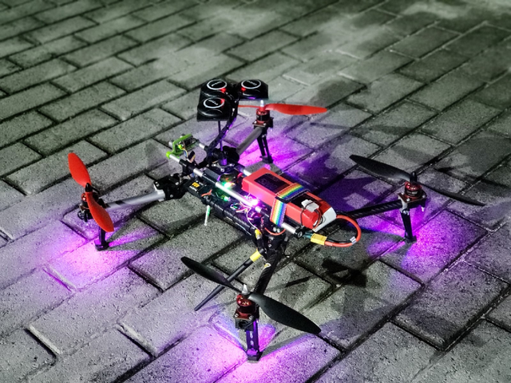

# GPS Mixer - way to improve GPS navigation using multiple receivers

This project was originated as a part of project activity in Moscow Polytech University by students of group 181-311.
This project is currently part of the AMLS (Autonomous Multicopter Landing System) project. The AMLS project was created as a part of project activities subject of Moscow Polytech University by the 181-311 group

----------

GPS Mixer © 2021 Pavel Neshumov (Fern H.)

GPS Mixer uses several low-cost GPS receivers (Ublox NEO-M8n) to improve the accuracy and reliability of GPS coordinates. Up to 3 receivers are currently in use.

GPS Mixer takes data from available receivers and calculates the arithmetic mean of the coordinates. Also, this solution will allow the drone to continue flying in the event of a loss of 1-2 receivers. In case of loss / appearance of receivers, there is a function to compensate for coordinate jumps.

----------
